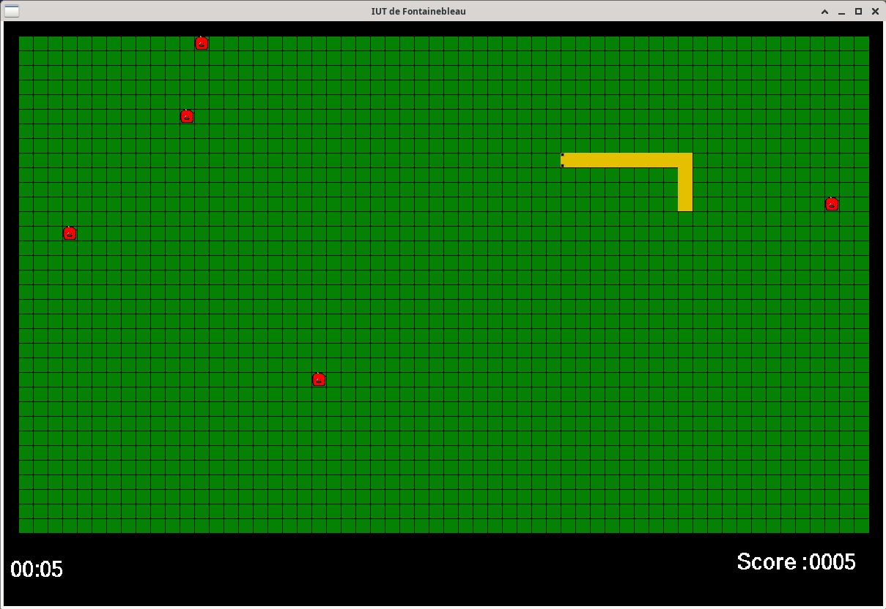

# Jeu Snake



## Introduction

Ce projet a été conçu dans le cadre d'un projet du premier semestre du BUT 1 Informatique à l'IUT de Fontainebleau. Il consiste en la création d'un jeu du serpent en C-89.

Pour connaître les règles de base du Snake, vous pouvez consulter cet article : [Règle du jeu](https://fr.wikipedia.org/wiki/Snake_(genre_de_jeu_vid%C3%A9o)#Concept)

## Fonctionnalités demandées

 -   Se déplacer avec les touches directionnelles du clavier
 -   Mise en pause du jeu lorsque la touche Espace est pressée
 -   Quitter la partie en cours lorsque la touche Échap est pressée
 -   Affichage du score 
 -   Affichage du temps 

## Fonctionnalité additionnelle

Le déplacement du serpent s'accélère en fonction du score.

## Lancement du programme

### Compilation et lancement du jeu

Placez vous dans le répertoire JEUX_SERPENT et utilisez la commande suivante pour compiler et lancer le jeu :
```bash
make run
```

## Auteurs

Conçu et développé par Wilfried BRIGITTE et Matis Rohaut.

## Note
16/20 (Évalué par Luc Hernandez)

